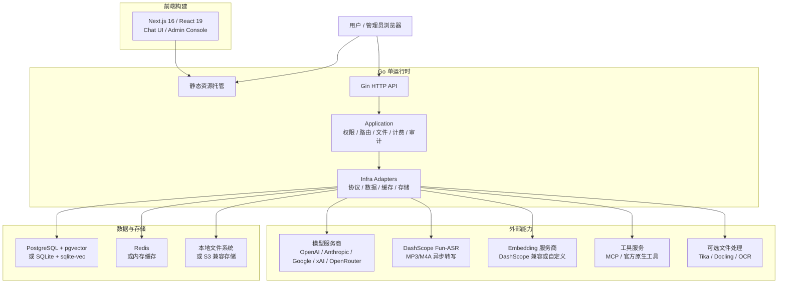

<p align="center">
  <picture>
    <source media="(prefers-color-scheme: dark)" srcset="./frontend/public/logo-white.svg" />
    
  </picture>
</p>

<p align="center">
  企业级模型路由、对话、文件、工具、计费、身份和运维的一体化 AI 平台。
</p>

<p align="center">
  <a href="../README.md">English</a> | 简体中文
</p>

<p align="center">
  <a href="https://deeix.com"></a>
  <a href="https://deeix.com/zh/docs/deeix-chat/quickstart"></a>
  <a href="https://t.me/deeix_chat"></a>
  <a href="https://x.com/DEEIX_AI"></a>
  <a href="https://www.apache.org/licenses/LICENSE-2.0"></a>
  
  
  
</p>

## 项目简介

DEEIX Chat 是一款开源可部署的 AI 平台，面向需要长期、稳定、统一使用多模型能力的个人、团队与企业。它用一个清晰的使用入口承载多个上游模型和服务商，将多模态对话、模型路由、文件与 RAG、MCP 工具、用量计费、身份认证、审计日志和运维控制整合到同一个产品中。

系统围绕简单部署、高效静态分发和低资源的运行时占用设计，轻量而不简陋、克制而不缺能力、开放而不失秩序。


## 核心能力

| 模块 | 能力 |
| --- | --- |
| 对话体验 | 面向日常高频使用的多模态对话界面，支持流式响应、多分支、重试、编辑、反馈、分享、富文本渲染和可追踪的模型执行信息。 |
| 模型与路由 | 以平台模型为统一入口管理上游渠道、真实模型、路由绑定、优先级、权重、熔断、厂商映射和能力配置，降低多供应商接入后的维护成本。模型能力可通过 `inputModalities` 声明仅文本或图片输入；显式声明为仅文本的模型添加原图时，前端会立即提示“当前模型不支持图片上传”并拦截，后端仍对最终上下文兜底校验。未配置该字段时保持历史兼容，选择图片附件处理器转成文本时仍可发送。 |
| 协议与适配 | 统一适配 OpenAI、Anthropic、Google/Gemini、xAI、OpenRouter 和 OpenAI 兼容协议，覆盖文本、图片、工具和不同厂商的原生能力差异。 |
| 文件与检索 | 提供文件上传、预览、提取、OCR、存储配额、全文注入、分片、向量嵌入和语义检索能力，让文件内容自然进入对话上下文。MP3/M4A 录音还支持异步转写、说话人分离、Transcript 编辑和时间窗口 RAG。 |
| 工具生态 | 同时支持 MCP Server 和厂商官方原生工具，覆盖工具发现、启停、用户选择、执行限制、结果渲染和调用链路追踪。 |
| 上下文与记忆 | 支持消息窗口、Token 预算、压缩摘要、会话记忆、长期记忆和 RAG 证据记录，在可控成本下维持连续对话体验。 |
| 计费与支付 | 内置模型定价、工具按次定价、订阅、充值、余额、用量账本、计费快照、Stripe Checkout、易支付和 Webhook 校验。 |
| 身份与安全 | 覆盖本地账号、会话管理、HttpOnly Refresh Cookie、2FA/TOTP、可信设备、SSO/OIDC/OAuth、联系方式验证和敏感信息加密。 |
| 管理与审计 | 后台集中管理用户、角色、上游、模型、路由、价格、订阅、余额、调用日志、审计日志、认证事件和系统事件。 |
| 部署与运维 | 支持单运行时托管前端与 API、Docker 部署、SQLite 或 PostgreSQL、内存缓存或 Redis、S3 兼容存储、Swagger、结构化日志、版本接口、GeoIP 和 OpenTelemetry。 |

<p align="center">
  
  
</p>

<p align="center">
  
  
  
</p>

## 系统架构与技术栈

DEEIX Chat 采用前后端分离开发、单运行时部署的结构。前端构建为静态资源后由 Go 服务统一托管，API、权限、模型路由、文件、计费和审计等后端能力由同一个运行时提供；文档提取、OCR 等重型能力以可选服务接入，避免基础部署过重。



| 层面 | 职责 | 主要技术 |
| --- | --- | --- |
| 前端 | 用户对话、后台管理、静态构建 | Next.js 16、React 19、TypeScript、Tailwind CSS、Shadcn/UI、Streamdown、KaTeX、Mermaid、Recharts、Motion |
| 后端运行时 | API、认证授权、业务编排、协议适配、静态资源托管 | Go 1.26、Gin、Gorm、Swagger、OpenTelemetry、Zap |
| 数据与缓存 | 领域数据、向量检索、会话状态、运行时缓存 | PostgreSQL、pgvector、SQLite、sqlite-vec、Redis、内存缓存 |
| 文件与存储 | 上传文件、生成文件、对象存储和本地持久化 | 本地文件系统、S3 兼容对象存储 |
| 文件处理 | 文本提取、OCR、文档解析、音频转写和 LLM OCR 回退 | 内置提取、DashScope Fun-ASR、Apache Tika、Docling、RapidOCR、Tesseract OCR、Paddle OCR、云 OCR 适配、MinerU |
| 工具协议 | MCP 工具接入和厂商官方原生工具调用 | MCP Streamable HTTP JSON-RPC、Provider Native Tools |
| 部署运行 | 单节点轻量部署或多节点生产部署 | Docker、Docker Compose、SQLite/内存缓存、PostgreSQL/Redis |

后端内部保持清晰分层：`cmd/internal/cli` 负责启动入口，`internal/app` 负责应用装配，`transport/http` 负责 HTTP 边界，`application` 负责业务用例与事务编排，`domain` 表达领域语义，`infra` 承载数据库、缓存、存储和外部协议实现。数据层按领域前缀组织表结构，财务流水、审计日志、系统事件和高增长向量数据保持独立事实源。

## 音频转写：MP3 与 M4A

录音作为一类独立文件附件处理。目前支持**单个 MP3 或 M4A 文件**：

- MP3：`audio/mpeg` / `.mp3`；
- M4A：`audio/mp4` / `.m4a`；
- 单个音频最大 `500 MB`，管理员可以调整音频单文件上限；
- WAV、视频音轨和批量转写暂不在当前范围内；
- 后端校验 MIME、扩展名、大小、SHA-256，以及合理的 MP3 Frame Header 或 MPEG-4 `ftyp` 容器头，不依赖 `ffprobe`。

### 处理流程

```text
浏览器上传
  → 私有 S3 兼容存储（通常为 MinIO）
  → 短期 HTTPS Presigned GET URL
  → DashScope Fun-ASR 异步任务
  → 持久化轮询与重启恢复
  → 转写产物和文件处理状态
  → 可选 Embedding 与时间窗口 RAG
```

后端始终启用 Fun-ASR 说话人分离，由模型自动估计说话人数。转写完成前，携带录音附件的聊天消息不能发送。Fun-ASR 失败后进入音频专属死信路径，只允许手动重试，不继承普通文档的自动重试策略。

每个完成的录音会生成三个对象：

| 产物 | 用途 | 可修改性 |
| --- | --- | --- |
| `result.raw.json` | 保存供应商原始响应，用于审计和排查 | Transcript API 不允许修改 |
| `transcript.json` | 标准化转写，包含时间戳、置信度、说话人名称和可编辑文本 | 通过带 revision 校验的 PATCH API 修改 |
| `transcript.md` | 文件页预览和检索使用的文本 | Transcript 修改后重新生成 |

进入 **Files → Transcript** 可以播放音频和编辑转写。可以重命名说话人，也可以逐句把当前句段重新归属到其他说话人。这些人工归属保存在 `speakerOverrides` 中；模型原始 `speakerID` 和原始结果保持不变。保存使用 revision compare-and-swap，编辑后的转写会重新进入 RAG Embedding。

Transcript 接口：

| 方法 | 接口 | 用途 |
| --- | --- | --- |
| `GET` | `/api/v1/files/:file_id/transcript` | 读取标准化 Transcript 和 revision |
| `PATCH` | `/api/v1/files/:file_id/transcript` | 携带 revision CAS 保存说话人名称、人工归属和句段文本 |
| `POST` | `/api/v1/files/:file_id/transcription/retry` | 手动重试失败的录音转写 |

### 音频和 RAG 配置

DashScope 凭证只配置在后端，不能暴露给浏览器：

```env
DASHSCOPE_API_KEY=<仅服务端使用的 DashScope API Key>
DASHSCOPE_BASE_URL=https://dashscope.aliyuncs.com/api/v1
```

音频转写需要能够生成 Fun-ASR 可访问的短期 HTTPS GET 地址的 S3 兼容对象存储。Bucket 应保持私有，只通过 HTTPS 反向代理暴露访问入口；不要发布 S3 凭证或永久对象 URL。

在后台管理中配置上传策略和音频处理设置：

- `file.allowed_mime_types` 必须包含 `audio/mpeg` 和 `audio/mp4`；
- `file.audio_max_bytes` 默认是 `524288000` 字节（`500 MB`）；
- `file.embedding_enabled` 控制转写完成后是否建立音频索引。

如需启用音频 RAG，在后台管理中配置运行时设置：

- `file.embedding_enabled=true`；
- `file.embedding_host` 指向兼容的 Embedding endpoint；
- `file.rag_model` 与 `file.embedding_output_dimensions` 和向量存储保持一致；
- `chat.rag_enabled=true`。

默认音频 RAG 使用句子边界切分，时间窗口约 2 分钟，相邻窗口重叠约 15 秒。聊天请求只检索相关时间范围，不会每次把完整录音正文注入 Prompt。

### 隐私和运行边界

录音可能包含个人隐私或机密信息。上传前应确认向配置的第三方 ASR 或 Embedding 服务发送该文件符合隐私和合规要求。系统正常日志不会打印 API Key、MinIO Secret、完整 Presigned URL 或完整供应商转写正文。生产环境还应配置 HTTPS 公开地址、备份、存储容量告警和恢复流程。

## 快速开始

> 快速安装教程：[快速开始](https://deeix.com/zh/docs/deeix-chat/quickstart)。

### 本地开发

本地开发适合改动源码并分别启动前后端。默认配置连接本机 PostgreSQL 和 Redis；如果只是低依赖试用，建议直接使用下面的 Docker 轻量安装。

1. 准备后端配置：

```bash
cp config.example.yaml config.yaml
```

根据本机环境调整 `config.yaml` 中的 `database.postgres.dsn`、`database.redis.*` 和公开访问地址。

2. 安装工作区依赖并准备前端环境：

```bash
pnpm install
cp frontend/.env.example frontend/.env.local
```

3. 同时启动前端和后端：

```bash
pnpm dev
```

只启动单个工作区时，使用 `pnpm dev:web` 或 `pnpm dev:api`。

前端请求后端使用 `NEXT_PUBLIC_API_BASE_URL`。本地开发时确认 `frontend/.env.local` 中包含：

```env
NEXT_PUBLIC_API_BASE_URL=http://127.0.0.1:8080
```

访问地址：

| 服务 | 地址 |
| --- | --- |
| 前端 | `http://localhost:3000` |
| API | `http://localhost:8080` |
| Swagger | `http://localhost:8080/swagger/index.html` |

不配置 `NEXT_PUBLIC_API_BASE_URL` 时，本地默认指向 `localhost:8080`；同源部署默认请求当前 origin。

### Docker 部署

Docker 部署先选择安装方案，再复制对应的配置文件。三套根目录 compose 文件都默认将应用暴露在 `http://localhost:8080`，并把仓库根目录的 `config.yaml` 挂载到容器内 `/app/config.yaml`。

| 方案 | 适合场景 | 配置文件 | Compose 文件 | 内置依赖 |
| --- | --- | --- | --- | --- |
| 轻量安装 | 本地试用、个人部署、小型单节点 | `config.sqlite.example.yaml` | `docker-compose.sqlite.yml` | 仅应用容器，SQLite + sqlite-vec + 内存缓存 |
| 默认安装 | 已有外部 PostgreSQL 和 Redis | `config.example.yaml` | `docker-compose.yml` | 仅应用容器 |
| 全量安装 | 单机同时部署应用、PostgreSQL 和 Redis | `config.full.example.yaml` | `docker-compose.full.yml` | 应用、PostgreSQL、Redis |

#### 1. 轻量安装：SQLite

依赖最少的部署方式，只启动 `app` 容器。数据和本地向量索引使用 SQLite，缓存使用进程内 memory，适合本地试用、个人部署和小型单节点场景。

```bash
cp config.sqlite.example.yaml config.yaml
docker compose -f docker-compose.sqlite.yml up -d
```

SQLite + memory cache 只适合单进程。多节点、高并发或更严格的生产部署建议使用 PostgreSQL + Redis。

#### 2. 默认安装：外部 PostgreSQL + Redis

适合已经有外部 PostgreSQL 和 Redis 的部署环境。启动前需要把数据库和 Redis 地址改成容器内可访问的地址；如果服务在 Docker 宿主机上，通常可以使用 `host.docker.internal`。

```bash
cp config.example.yaml config.yaml
# 修改 database.postgres.dsn、database.redis.* 和公开访问地址
docker compose up -d
```

默认 `docker-compose.yml` 只启动应用容器。除非明确需要覆盖 `config.yaml`，否则不要在 compose 里额外写同名 `environment`。

#### 3. 全量安装：PostgreSQL + Redis 容器

适合希望 compose 同时启动应用、PostgreSQL 和 Redis 的部署方式。

```bash
cp config.full.example.yaml config.yaml
docker compose -f docker-compose.full.yml up -d
```

`docker-compose.full.yml` 会在 compose `environment` 中设置 `POSTGRES_DSN`、`REDIS_ADDR`、`REDIS_USERNAME` 和 `REDIS_PASSWORD`，因此这些值会覆盖 `config.yaml` 里的数据库和 Redis 配置。

#### 配置、持久化和镜像

配置优先级是：`环境变量 > config.yaml > 代码内置默认值`。`config.yaml` 负责品牌和静态基础设施、安全配置，例如品牌资源、服务地址、数据库、缓存、存储、GeoIP、Trace、JWT 和加密密钥。运行时业务配置存储在数据库中，并通过后台管理修改。

默认 compose 会持久化应用数据：

| 数据 | 容器路径 |
| --- | --- |
| SQLite 数据库 | `/app/data/deeix.db` |
| 上传文件和生成文件 | `/app/storage` |
| PostgreSQL 数据 | `/var/lib/postgresql/data`，仅全量安装 |
| Redis 数据 | `/data`，仅全量安装 |

默认应用镜像为 `ghcr.io/deeix-ai/deeix-chat:latest`。测试自定义构建时可通过 `DEEIX_CHAT_IMAGE` 覆盖：

```bash
DEEIX_CHAT_IMAGE=deeix-chat:local docker compose up -d --build
```

#### 维护者部署说明

- 多架构镜像的 canonical workflow 是 `.github/workflows/ghcr-image.yml`，负责发布 `amd64` 和 `arm64` 镜像到 GHCR。
- 资源受限的 VPS 应直接拉取已发布镜像，不要在 VPS 上执行 Next.js/Turbopack 生产构建或本地多架构 Docker 构建。
- 低依赖测试方案使用 `docker-compose.sqlite.yml`，组合 SQLite、`sqlite-vec`、进程内 memory cache 和外部私有 S3 兼容存储（例如 MinIO）。
- MinIO 应保持私有。Fun-ASR 只需要短期 HTTPS Presigned GET URL；不要把 `9000` 和 `9001` 端口直接暴露到公网。
- 运行时密钥应放在仓库外，禁止提交 `DASHSCOPE_API_KEY`、S3 凭证、GHCR Token 或完整 Presigned URL。

`APP_ENV` 支持 `dev`/`development` 和 `prod`/`production`，内部会规范化为 `dev` 或 `prod`；未配置时默认 `prod`。`dev` 只用于本地开发；公网生产部署应保持 `APP_ENV=prod` 或 `APP_ENV=production` 并使用生产密钥。

#### 可选安装服务

这些服务不是必须安装。只有在后台或 `config.yaml` 中启用对应文件处理能力时才需要启动。
这些 compose 文件会接入 `deeix-chat-network`；请先启动任一根目录 compose 方案，或手动执行 `docker network create deeix-chat-network`。

```bash
docker compose -f docker/tika/docker-compose.yml up -d
docker compose -f docker/tesseract/docker-compose.yml up -d --build
docker compose -f docker/docling/docker-compose.yml up -d --build
```

默认本地地址：

| 服务 | 地址 | 用途 |
| --- | --- | --- |
| Tika | `http://127.0.0.1:9998` | 文档文本提取 |
| Tesseract OCR | `http://127.0.0.1:8004/ocr` | OCR 服务 |
| Docling | `http://127.0.0.1:8005/ocr` | 文档/OCR 提取 |

`docker/rapidocr` 当前提供 Dockerfile 和服务入口，但还没有 compose 文件。如果选择 RapidOCR，需要自行补 compose 或手动运行。

### 分离部署

当前端和后端分别暴露在不同公网地址时使用分离部署，例如 `https://chat.example.com` 和 `https://api.example.com`。

1. 配置公开地址。

   - 前端构建变量：`NEXT_PUBLIC_API_BASE_URL=https://api.example.com`
   - 后端配置：`server.public_api_base_url=https://api.example.com`
   - 后端配置：`server.public_web_base_url=https://chat.example.com`
   - 后端配置：`server.cors_allow_origin=https://chat.example.com`

   Docker 镜像构建时需要传入前端 API 地址：

   ```bash
   docker build --build-arg NEXT_PUBLIC_API_BASE_URL=https://api.example.com -t deeix-chat .
   ```

2. 构建并发布前端。

   ```bash
   pnpm install
   NEXT_PUBLIC_API_BASE_URL=https://api.example.com pnpm --filter @deeix/web build
   ```

   静态产物在 `frontend/out`，可由 Nginx、CDN、对象存储或任意静态服务托管。如需由 Go 后端托管前端，把 `frontend/out` 放到 `server.frontend_dist_dir` 指向的目录；Docker 镜像默认是 `/app/frontend/out`。

3. 配置 CDN 规则。

   | 路径 | 规则 |
   | --- | --- |
   | `/_next/static/*` | 缓存 1 年，并启用 immutable 静态资源缓存。 |
   | `/logo*.svg`、`/*.ico`、`/*.png`、`/*.jpg`、`/*.webp`、`/*.woff2` | 缓存 1 天到 30 天。 |
   | `/`、`/*.html`、`/chat*`、`/recent*`、`/files*`、`/setting*`、`/admin*`、`/share*` | 不做长期缓存，建议使用 `no-cache` 或较短 TTL。 |
   | `/api/*`、`/healthz`、`/readyz`、`/swagger/*` | 绕过 CDN 缓存，并完整转发请求头、方法、查询参数和请求体。 |

   如果 CDN 从对象存储托管 `frontend/out`，需要开启路由回退，让无扩展名地址能命中导出的 `index.html`，例如 `/chat` -> `/chat/index.html`。

### 启动后检查与首次登录

应用启动后，先确认健康检查、配置文件和启动日志。Docker 部署可用：

```bash
curl http://localhost:8080/healthz
docker compose exec app ls -l /app/config.yaml
docker compose logs app
```

如果数据库中还不存在超级管理员，后端会在首次启动时自动创建初始管理员，并且只在创建当次输出一次初始密码。

| 项目 | 说明 |
| --- | --- |
| 初始用户名 | `admin` |
| 初始密码 | 查看后端启动日志，搜索 `bootstrap superadmin created`，读取其中的 `password` 字段。 |
| 首次登录 | 系统会要求修改用户名和密码。 |
| 后续变更 | 通过账户流程或后台管理完成；不会通过 `config.yaml` 修改。 |

如果数据库中已经存在超级管理员，服务不会重新生成或再次输出初始密码。

## 配置说明

> 完整配置说明：[配置说明](https://deeix.com/zh/docs/deeix-chat/configuration)。

后端配置分为静态运行配置和运行时业务配置。静态运行配置用于描述品牌以及服务启动所需的基础设施、安全和存储参数，由 `config.yaml` 与环境变量提供；运行时业务配置用于认证、会话、模型、文件、计费等产品能力，写入 `system_settings` 并通过后台管理维护。环境变量会覆盖配置文件中的同名项，适合容器化、分离部署和密钥注入场景。

后端启动时会按运行目录解析默认配置文件：从仓库根目录启动读取 `config.yaml`，从 `backend/` 目录启动读取 `../config.yaml`。Docker 部署通常将宿主机 `./config.yaml` 只读挂载到容器内 `/app/config.yaml`；如果配置文件放在其他位置，请使用 `CONFIG_FILE` 指向实际运行环境可访问的路径。

前端品牌同样属于运行时配置。在 `config.yaml` 中设置 `branding` 后重启应用即可生效，无需重新构建前端或 Docker 镜像。详见[自定义品牌资源](./BRANDING.md)。

静态配置环境变量：

| 所属域 | 环境变量 | 说明 |
| --- | --- | --- |
| 前端构建 | `NEXT_PUBLIC_API_BASE_URL` | 浏览器请求后端 API 的地址；本地写入 `frontend/.env.local`，分离部署在构建时传入。 |
| 配置文件 | `CONFIG_FILE` | 可选配置文件路径；Docker 场景应填写容器内路径。 |
| 应用 | `APP_NAME` | 应用名称。 |
| 应用 | `APP_ENV` | 运行环境，支持 `dev`/`development` 和 `prod`/`production`；未配置时默认 `prod`。 |
| HTTP 服务 | `HTTP_PORT` | API/运行时端口。 |
| HTTP 服务 | `CORS_ALLOW_ORIGIN` | 允许跨域访问的来源，多个来源用逗号分隔。 |
| HTTP 服务 | `TRUSTED_PROXIES` | 可信代理 CIDR 列表。 |
| HTTP 服务 | `PUBLIC_API_BASE_URL` | 对外 API 地址，用于链接、回调和公开地址生成。 |
| HTTP 服务 | `PUBLIC_WEB_BASE_URL` | 对外 Web 地址，用于链接、回调和公开地址生成。 |
| HTTP 服务 | `FRONTEND_DIST_DIR` | 前端静态产物目录。 |
| HTTP 服务 | `HTTP_READ_HEADER_TIMEOUT_SECONDS` | HTTP 读取请求头超时。 |
| HTTP 服务 | `HTTP_READ_TIMEOUT_SECONDS` | HTTP 请求读取超时。 |
| HTTP 服务 | `HTTP_IDLE_TIMEOUT_SECONDS` | HTTP keep-alive 空闲超时。 |
| HTTP 服务 | `HTTP_MAX_HEADER_BYTES` | HTTP 请求头最大字节数。 |
| 安全 | `JWT_SECRET` | JWT 签名密钥。 |
| 安全 | `DATA_ENCRYPTION_KEY` | 上游 API Key、SSO Secret、MCP Token、敏感设置和 TOTP Secret 的加密密钥材料。 |
| 安全 | `SSRF_PROTECTION_ENABLED` | 是否启用出站 SSRF 防护。 |
| 安全 | `SSRF_ALLOWED_HOSTS` | 部署级集成或可信私网重定向目标的主机名，逗号分隔。 |
| 安全 | `SSRF_ALLOWED_CIDRS` | 部署级集成或可信私网重定向目标的 CIDR 网段，逗号分隔。 |
| 安全 | `TURNSTILE_SITEVERIFY_URL` | Cloudflare Turnstile siteverify 端点。 |
| 语音 / ASR | `DASHSCOPE_API_KEY` | 服务端使用的 DashScope API Key，用于 Fun-ASR，以及在满足安全条件时用于官方 DashScope 兼容 Embedding endpoint。不能暴露给前端。 |
| 语音 / ASR | `DASHSCOPE_BASE_URL` | Fun-ASR 使用的 DashScope API base URL，默认 `https://dashscope.aliyuncs.com/api/v1`。 |
| 数据库 | `DATABASE_DRIVER` | `postgres` 或 `sqlite`。 |
| PostgreSQL | `POSTGRES_DSN` | PostgreSQL DSN。 |
| PostgreSQL | `POSTGRES_MAX_OPEN_CONNS` | 最大打开连接数。 |
| PostgreSQL | `POSTGRES_MAX_IDLE_CONNS` | 最大空闲连接数。 |
| PostgreSQL | `POSTGRES_CONN_MAX_LIFETIME_MINUTES` | 连接最长生命周期。 |
| PostgreSQL | `POSTGRES_CONN_MAX_IDLE_TIME_MINUTES` | 连接最长空闲时间。 |
| SQLite | `SQLITE_PATH` | 数据库文件路径。 |
| SQLite | `SQLITE_DSN` | 完整 DSN；设置后优先于路径拼装。 |
| SQLite | `SQLITE_MAX_OPEN_CONNS` | 最大打开连接数，默认 `1`。 |
| SQLite | `SQLITE_BUSY_TIMEOUT_MS` | busy timeout。 |
| SQLite | `SQLITE_CACHE_SIZE_KB` | page cache 大小。 |
| SQLite | `SQLITE_MMAP_SIZE_BYTES` | mmap 大小。 |
| SQLite | `SQLITE_SYNCHRONOUS` | 同步模式：`OFF`、`NORMAL`、`FULL`、`EXTRA`。 |
| SQLite | `SQLITE_TEMP_STORE` | 临时存储：`DEFAULT`、`FILE`、`MEMORY`。 |
| 缓存 | `CACHE_DRIVER` | `redis` 或 `memory`；`memory` 仅适用于单进程。 |
| Redis | `REDIS_ADDR` | Redis 地址。 |
| Redis | `REDIS_USERNAME` | Redis ACL 用户名；使用仅密码或默认用户 Redis 时留空。 |
| Redis | `REDIS_PASSWORD` | Redis 密码。 |
| Redis | `REDIS_DB` | Redis DB 编号。 |
| Redis | `REDIS_TLS_ENABLED` | 启用 Redis TLS 连接，例如 Upstash Redis。 |
| Redis | `REDIS_TLS_INSECURE_SKIP_VERIFY` | 跳过 Redis TLS 证书校验；除非非标准端点确实要求，否则保持 `false`。 |
| 存储 | `STORAGE_BACKEND` | `local` 或 `s3`。 |
| 本地存储 | `STORAGE_ROOT_DIR` | 本地文件存储目录。 |
| S3 存储 | `STORAGE_S3_ENDPOINT` | S3 兼容服务 endpoint。 |
| S3 存储 | `STORAGE_S3_REGION` | S3 region；使用 S3 时必填。 |
| S3 存储 | `STORAGE_S3_BUCKET` | S3 bucket；使用 S3 时必填。 |
| S3 存储 | `STORAGE_S3_PREFIX` | S3 对象前缀。 |
| S3 存储 | `STORAGE_S3_ACCESS_KEY_ID` | S3 Access Key ID。 |
| S3 存储 | `STORAGE_S3_SECRET_ACCESS_KEY` | S3 Secret Access Key。 |
| S3 存储 | `STORAGE_S3_FORCE_PATH_STYLE` | 是否使用 path-style 访问。 |
| GeoIP | `GEOIP_PROVIDER` | `none`、`ipwhois`、`ipinfo` 或 `mmdb`。 |
| GeoIP | `GEOIP_BASE_URL` | GeoIP HTTP 服务地址，默认 `https://ipwho.is`。 |
| GeoIP | `GEOIP_TOKEN` | GeoIP 服务 Token。 |
| GeoIP | `GEOIP_TIMEOUT_MS` | GeoIP 请求超时。 |
| GeoIP | `GEOIP_DATABASE_URL` | MMDB 下载地址。 |
| GeoIP | `GEOIP_DATABASE_PATH` | MMDB 本地路径。 |
| GeoIP | `GEOIP_DATABASE_MAX_BYTES` | MMDB 最大下载字节数。 |
| GeoIP | `GEOIP_REFRESH_INTERVAL_HOURS` | MMDB 刷新间隔。 |
| OpenTelemetry | `OTEL_ENABLED` | 是否启用 Trace；未显式设置时，配置 endpoint 会自动启用。 |
| OpenTelemetry | `OTEL_EXPORTER_OTLP_ENDPOINT` | OTLP Collector 地址。 |
| OpenTelemetry | `OTEL_EXPORTER_OTLP_HEADERS` | OTLP 请求头，格式为 `key=value,key2=value2`。 |
| OpenTelemetry | `OTEL_EXPORTER_OTLP_INSECURE` | 是否使用明文传输。 |
| OpenTelemetry | `OTEL_EXPORTER_OTLP_PROTOCOL` | OTLP exporter 协议：`grpc`、`http` 或 `http/protobuf`；默认 `grpc`。 |
| OpenTelemetry | `OTEL_TRACES_SAMPLER_ARG` / `OTEL_SAMPLING_RATE` | Trace 采样率，范围 `0~1`；`OTEL_TRACES_SAMPLER_ARG` 优先。 |

认证、注册、会话配置、模型参数策略、文件处理、RAG、Embedding、MCP、计费、支付和公告等运行时业务配置不属于静态 YAML 配置，默认值由后端种子初始化，并在后台管理中维护。

生产环境启用 SSRF 防护后，管理员保存的模型、MCP、Embedding、OIDC/OAuth2 和自定义 Turnstile endpoint 均按精确 origin（协议、主机和端口）获得局部授权，不需要加入全局白名单。模型、MCP 与 Embedding 保留标准重定向兼容性：跨 origin 的公网目标可以继续访问，跨 origin 的私网目标必须命中 `SSRF_ALLOWED_HOSTS` 或 `SSRF_ALLOWED_CIDRS`；OIDC/OAuth2 与 Turnstile 继续维持更严格的身份边界。模型生成的图片或视频由后端下载、校验并转存：私网制品 URL 只有与本次选中的模型 endpoint 同 origin 时才继承该局部信任；跨 origin 的公网制品仍按严格公网策略下载，跨 origin 的私网制品会被拦截。全局白名单也继续用于无法绑定管理员保存 endpoint 的部署级集成，例如部分 GeoIP 或提取服务部署。链路本地、组播、未指定地址和已知云元数据目标始终禁止。白名单配置不合法会阻止后端启动；全局白名单修改后需重启生效。

### Web、App 与桌面端 OAuth 回调（多端暂未发布）

启用第三方授权桥前，请先把 `PUBLIC_API_BASE_URL` 配置为外部可访问的 API 地址。每个 OIDC/OAuth2 身份源都应登记后台身份源弹窗展示的服务器回调：

```text
<PUBLIC_API_BASE_URL>/api/v1/auth/providers/<provider-slug>/callback
```

Web、App 与桌面端会自动复用当前实例的这个回调。外部身份源的授权码和 Client Secret 始终留在用户自己的服务器；公共客户端只会收到一个短时、单次使用并绑定 PKCE verifier 的 DEEIX 授权码。如果仍需使用账号身份绑定或兼容旧版 Web 客户端，请同时保留后台展示的旧版 Web 回调地址。

## 功能指南

- [用户指南](https://deeix.com/zh/docs/deeix-chat/new-chat)
- [管理指南](https://deeix.com/zh/docs/deeix-chat/admin-accounts)
- [进阶指南](https://deeix.com/zh/docs/deeix-chat/advanced-capabilities-passthrough-tools)

### MCP 默认工具

管理员在后台启用 MCP 后，打开聊天输入框的 MCP 插头菜单，即可选择当前会话要使用的工具。工具右侧的星标用于设置该工具的默认使用；MCP Server 行右侧的星标会将该 Server 当前列出的全部工具设为默认。复选框只影响当前会话，星标保存到当前用户的 `chat.default_mcp_tool_ids`，并仅在新建对话时自动带入；已有会话不会被修改。项目设置为 `mcpDefaultMode=custom`（项目自定义 MCP）时，会覆盖当前用户的个人默认工具；选择“继承全局”时则沿用用户在聊天 MCP 菜单中的星标默认。

## 开发与验证

在仓库根目录安装依赖后执行工作区检查：

```bash
pnpm check
pnpm test
```

常用的定向命令：

```bash
pnpm --filter @deeix/web check
pnpm --filter @deeix/api test
pnpm api:check
```

如果修改了 API contract，提交前重新生成并检查共享契约：

```bash
pnpm api:generate
pnpm api:check
```

## 安全说明

- 用户密码使用 bcrypt 哈希存储。
- 生产模式会拒绝不安全的默认密钥、过短的加密密钥、通配 CORS 和非 HTTPS 公开地址。
- Refresh Token 和恢复类凭证只存储哈希。
- 上游 API Key、SSO Client Secret、MCP 鉴权 Token、敏感系统设置和 TOTP Secret 使用 `DATA_ENCRYPTION_KEY` 通过 AES-GCM 加密。
- Access Token 为短期令牌并保存在前端内存中；Refresh Token 由后端写入 HttpOnly Cookie。
- 用户输入的模型参数会在请求上游前经过白名单/黑名单过滤。模型名、消息、工具、系统提示词、请求头和 previous response 标识等系统链路字段不允许被用户 options 覆盖。

## 文档入口

- [快速开始](https://deeix.com/zh/docs/deeix-chat/quickstart)
- [配置说明](https://deeix.com/zh/docs/deeix-chat/configuration)
- [用户指南](https://deeix.com/zh/docs/deeix-chat/new-chat)
- [管理指南](https://deeix.com/zh/docs/deeix-chat/admin-accounts)
- [进阶指南](https://deeix.com/zh/docs/deeix-chat/advanced-capabilities-passthrough-tools)
- 后端说明：[backend/README.md](../backend/README.md)
- 后端规范：[backend/docs/README.md](../backend/docs/README.md)
- 前端说明：[frontend/README.md](../frontend/README.md)
- 贡献指南：[CONTRIBUTING.md](../.github/CONTRIBUTING.md)
- 安全策略：[SECURITY.md](../.github/SECURITY.md)
- Swagger UI：`http://localhost:8080/swagger/index.html`
- 音频/MinIO 部署手册：[MINIO-DEPLOYMENT.md](../MINIO-DEPLOYMENT.md)

## 鸣谢

DEEIX Chat 基于开源生态构建，感谢所有 AI 工具生态中的维护者和社区。

- [Next.js](https://nextjs.org)
- [Go](https://go.dev)
- [LINUX DO](https://linux.do)

## 联系&交流

- 官网：[deeix.com](https://deeix.com/)
- 博客：[blog.cheny.me](https://blog.cheny.me/)
- 邮箱：[support@deeix.com](mailto:support@deeix.com)
- Telegram：[t.me/deeix_chat](https://t.me/deeix_chat)
- 推特 / X：[@DEEIX_AI](https://x.com/DEEIX_AI)

## 开源协议

DEEIX Chat 使用 [Apache License 2.0](../LICENSE) 授权。
